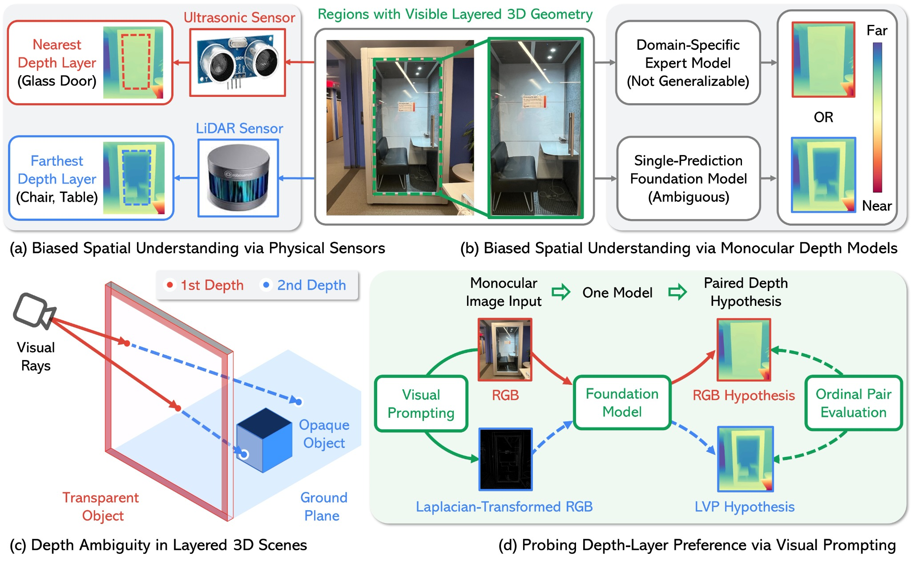

# One Scene, Two Depths: Probing Geometric Ambiguity in Monocular Foundation Models

[]()
[](https://arxiv.org/abs/2503.06014)
[](https://huggingface.co/datasets/xiaohaox/MultiDepth-3K-Dataset)
[](https://www.youtube.com/watch?v=38aSFah2jds)

> **What should a monocular depth model report when one camera ray contains two valid depths?**

This repository accompanies the ECCV 2026 paper **One Scene, Two Depths: Probing Geometric Ambiguity in Monocular Foundation Models**.

Monocular depth models usually output **one scalar depth per pixel**. This assumption works well for many opaque scenes, but it becomes fragile when visibility is layered. In transparent scenes, a single ray can pass through a foreground glass surface while also observing the background behind it. In such cases, a single-output depth model must resolve the ambiguity into one reported layer. This repository studies that behavior as **depth-layer preference**.

The repository provides code and benchmark materials to:

* measure **depth-layer preference** on **MultiDepth-3K (MD-3K)**,
* probe frozen models with **Laplacian Visual Prompting (LVP)**,
* evaluate paired RGB/LVP hypotheses with **Multi-Layer Spatial Relationship Accuracy (ML-SRA)**,
* and compare against **DA-2K** as a mostly non-ambiguous ordinal-depth reference.

## Teaser



**Figure overview.** **(a)** Different sensing mechanisms can privilege different physical layers in transparent scenes. **(b)** A standard single-prediction monocular depth model also resolves layered geometry into one reported layer. **(c)** Transparent scenes provide a clean example of layered 3D ambiguity, where a single ray intersects more than one valid surface. **(d)** We probe this behavior using **Laplacian Visual Prompting (LVP)**. A frozen foundation model is queried with both RGB and Laplacian-transformed RGB, producing a paired hypothesis that can be evaluated against both valid depth layers.

## Why this repository matters

Most depth benchmarks ask whether a prediction is accurate. MD-3K asks a different question:

> **Which valid layer does a monocular depth model choose to report?**

This shift turns transparent scenes into a diagnostic lens on how single-output monocular depth models behave under geometric ambiguity. The goal is not to claim dense metric multi-layer depth recovery. The goal is to expose and measure how current depth foundation models behave when a scene admits more than one valid geometric interpretation along the same viewing ray.

## Core concepts

### MultiDepth-3K (MD-3K)

**MD-3K** is a real-world transparent-scene benchmark with sparse ordinal labels for **two valid ray-wise depth layers**:

* **Layer 1:** the transparent foreground surface.
* **Layer 2:** the visible background behind the transparent surface.

MD-3K contains RGB images, ambiguous-region masks, and sparse point-pair annotations. The benchmark is partitioned into:

* **Same subset:** foreground and background layers induce the same ordinal relation.
* **Reverse subset:** foreground and background layers induce conflicting ordinal relations.

The Reverse subset is the key diagnostic setting where a duplicated single-depth hypothesis cannot satisfy both valid layer relations.

### Depth-layer preference

A single-output depth model must resolve layered geometry into one reported layer. We characterize this behavior as the model's **depth-layer preference**.

Given foreground-layer spatial relationship accuracy `SRA(1)` and background-layer spatial relationship accuracy `SRA(2)`, we define:

```text
alpha = SRA(2) - SRA(1)
```

A positive `alpha` indicates stronger background-layer preference. A negative `alpha` indicates stronger foreground-layer preference.

### Laplacian Visual Prompting (LVP)

**LVP** is a deterministic, training-free spectral input transformation. In this repository, it is used as an **input-space behavioral probe**, not as a universal layer switch.

LVP has no learned parameters and no checkpoint. Therefore, we do **not** release LVP as a separate Hugging Face model. The intended use is to apply the transform to the input image, map the result back to a standard RGB image representation, and pass it through the same depth-model processor used for the original RGB image.

### Multi-Layer Spatial Relationship Accuracy (ML-SRA)

**ML-SRA** evaluates whether a paired RGB/LVP candidate set can jointly satisfy the ordinal relations of the two valid depth layers under a fixed benchmark-level assignment.

In the paper protocol, RGB and LVP are paired according to the model's RGB depth-layer preference at the benchmark level:

* If RGB prefers **layer 1**, assign RGB to layer 1 and LVP to layer 2.
* If RGB prefers **layer 2**, assign RGB to layer 2 and LVP to layer 1.

This is the assignment used for the paper's reported ML-SRA results. It is a fixed benchmark-level assignment, not a per-image oracle and not automatic layer selection.

## Important scope notes

* LVP is **not** a universal mechanism for recovering all hidden layers.
* ML-SRA does **not** use a per-image oracle.
* MD-3K is a focused diagnostic benchmark for transparent-scene ambiguity.
* MD-3K uses sparse ordinal point-pair labels, not dense metric multi-layer ground truth.
* LVP can reduce standard dense-depth fidelity on non-ambiguous scenes, so standard RGB inference remains the default choice for ordinary single-depth evaluation.

## Repository structure

```text
.
├── assets/
│   └── readme_teaser_figure.png        # README teaser and visual assets
├── dataset/
│   └── MD3K_Dataset_README.md          # MD-3K dataset documentation
├── src/
│   ├── depth_estimation_mp.py          # Depth generation under RGB/LVP inputs
│   ├── DA2K_eval.py                    # DA-2K ordinal evaluation
│   ├── DA2K_stat.py                    # DA-2K SRA statistics
│   ├── MD3K_eval.py                    # MD-3K ordinal evaluation
│   ├── MD3K_stat.py                    # MD-3K SRA(1)
│   ├── MD3K_stat_SRA2.py               # MD-3K SRA(2)
│   ├── MD3K_stat_SEP.py                # Same/Reverse subset statistics
│   └── MD3K_stat_com.py                # ML-SRA for RGB/LVP pairs
├── utils/
│   ├── json_vis.py                     # Annotation visualization
│   ├── mask_eval.py                    # Mask evaluation
│   ├── mask_distribution.py            # Ambiguous-region distribution visualization
│   ├── depth_3D.py                     # Interactive depth visualization
│   └── vis_combined.py                 # Combined qualitative visualization
├── README.md
└── requirements.txt
```

## Installation

```bash
git clone https://github.com/Xiaohao-Xu/Ambiguity-in-Space.git
cd Ambiguity-in-Space

conda create -n one-scene-two-depths python=3.10
conda activate one-scene-two-depths

pip install -r requirements.txt
```

Install PyTorch separately with the CUDA version appropriate for your environment. For example, follow the official PyTorch installation selector for your CUDA version before running the evaluation scripts.

## Data

### MD-3K dataset setup

The MD-3K benchmark is released on Hugging Face:

```text
https://huggingface.co/datasets/xiaohaox/MultiDepth-3K-Dataset
```

Install the Hugging Face Hub client:

```bash
pip install -U huggingface_hub
```

Download and extract the dataset:

```python
from pathlib import Path
from zipfile import ZipFile
from huggingface_hub import hf_hub_download

zip_path = hf_hub_download(
    repo_id="xiaohaox/MultiDepth-3K-Dataset",
    filename="MD-3K.zip",
    repo_type="dataset",
)

out_dir = Path("data")
out_dir.mkdir(parents=True, exist_ok=True)

with ZipFile(zip_path, "r") as zf:
    zf.extractall(out_dir)

print(f"Extracted MD-3K to: {out_dir.resolve()}")
```

After extraction, the expected local structure is:

```text
data/MD-3K/
├── images/
├── masks/
└── annotations.json
```

The expected SHA256 checksum for the released archive is:

```text
3e9627d3aca6886a4449fd149b7ec791d13943d423fc5ee14f611c986bdecd29  MD-3K.zip
```

To verify the archive:

```bash
sha256sum MD-3K.zip
```

On Windows PowerShell:

```powershell
Get-FileHash -Algorithm SHA256 MD-3K.zip
```

Please see [`dataset/MD3K_Dataset_README.md`](dataset/MD3K_Dataset_README.md) for annotation details, metric definitions, and evaluation cautions.

### DA-2K

For DA-2K, follow the data instructions from the Depth Anything V2 repository and place the dataset under:

```text
data/DA-2K/
```

## Basic workflow

The current codebase uses **path-edited experiment scripts**. Before running each script, open the file and update dataset paths, output folders, model settings, and GPU settings for your local machine.

The overall pipeline is:

1. Generate depth maps under standard RGB input and LVP input.
2. Convert predicted depth maps into ordinal point-pair predictions on MD-3K.
3. Compute **SRA(1)** on the transparent foreground layer.
4. Compute **SRA(2)** on the visible background layer.
5. Compute depth-layer preference with `alpha = SRA(2) - SRA(1)`.
6. Compute **ML-SRA** for paired RGB/LVP hypotheses.
7. Optionally run **DA-2K** as a mostly non-ambiguous reference.

### Step 1: Generate depth maps

Use `src/depth_estimation_mp.py` to generate predictions. The current script is configured by editing variables inside the file.

For standard RGB inference:

```python
input_folder = "./data/MD-3K/images"
output_folder = "./outputs/md3k_rgb"
output_vis_folder = "./outputs/md3k_rgb_vis"
gau_size = 0
lvp_type = -1
```

For LVP inference:

```python
input_folder = "./data/MD-3K/images"
output_folder = "./outputs/md3k_lvp"
output_vis_folder = "./outputs/md3k_lvp_vis"
gau_size = 0
lvp_type = 1
```

Run:

```bash
python src/depth_estimation_mp.py
```

### Important: depth convention before ordinal evaluation

Before comparing predicted depth maps with MD-3K ordinal labels, verify the **definition and direction of the model output**.

Some models output depth-like values, where larger values indicate farther points. Other models output inverse-depth or disparity-like values, where larger values indicate nearer points. MD-3K evaluation assumes a consistent near/far convention. If a model output is inverse depth or disparity, convert it to depth, or equivalently flip the ordinal comparison, before computing SRA(1), SRA(2), depth-layer preference, or ML-SRA.

Otherwise, near/far relations can be reversed and the reported accuracy will be incorrect.

### Step 2: Convert depth maps into ordinal predictions

Use `src/MD3K_eval.py` to compare each predicted depth map against the sparse MD-3K point-pair annotations.

For RGB predictions, edit:

```python
json_path = "./data/MD-3K/annotations.json"
raw_path = "./data/MD-3K"
depth_res_path = "./outputs/md3k_rgb"
output_folder = "./eval/md3k_rgb"
```

For LVP predictions, edit:

```python
json_path = "./data/MD-3K/annotations.json"
raw_path = "./data/MD-3K"
depth_res_path = "./outputs/md3k_lvp"
output_folder = "./eval/md3k_lvp"
```

Then run:

```bash
python src/MD3K_eval.py
```

### Step 3: Compute SRA(1), SRA(2), and depth-layer preference

Foreground-layer agreement:

```bash
python src/MD3K_stat.py
```

Background-layer agreement:

```bash
python src/MD3K_stat_SRA2.py
```

Depth-layer preference:

```text
alpha = SRA(2) - SRA(1)
```

A positive `alpha` indicates stronger background-layer preference. A negative `alpha` indicates stronger foreground-layer preference.

### Step 4: Compute ML-SRA for paired RGB/LVP hypotheses

Use `src/MD3K_stat_com.py` to evaluate RGB and LVP outputs as a paired candidate set.

In the paper protocol, RGB and LVP are paired according to the model's RGB depth-layer preference at the benchmark level:

* If RGB prefers **layer 1**, assign RGB to layer 1 and LVP to layer 2.
* If RGB prefers **layer 2**, assign RGB to layer 2 and LVP to layer 1.

This is the assignment used for the paper's reported ML-SRA results. It is a fixed benchmark-level assignment, not a per-image oracle and not automatic layer selection.

### Step 5: Optional DA-2K reference evaluation

Use:

```bash
python src/DA2K_eval.py
python src/DA2K_stat.py
```

Apply the same depth-convention caution here. If a model output is inverse depth or disparity, convert it or flip the ordinal comparison before reporting DA-2K results.

## Visualization utilities

```bash
python utils/json_vis.py
python utils/mask_distribution.py
python utils/depth_3D.py
python utils/vis_combined.py
```

These utilities help inspect MD-3K annotations, ambiguous-region masks, RGB/LVP depth outputs, and qualitative paired-hypothesis behavior. Some scripts may require local path edits.

## Notes for reproducibility

* Use the exact same depth convention when comparing different models.
* Keep RGB and LVP predictions in separate output folders.
* Report SRA(1), SRA(2), depth-layer preference, and ML-SRA together when analyzing layered ambiguity.
* Analyze Same and Reverse subsets separately when possible.
* For ML-SRA, use the benchmark-level RGB/LVP assignment described above rather than per-image assignment.

## Citation

If you use this repository or MD-3K, please cite:

```bibtex
@inproceedings{xu2026onescenetwodepths,
  title={One Scene, Two Depths: Probing Geometric Ambiguity in Monocular Foundation Models},
  author={Xu, Xiaohao and Xue, Feng and Li, Xiang and Li, Haowei and Yang, Shusheng and Zhang, Tianyi and Johnson-Roberson, Matthew and Huang, Xiaonan},
  booktitle={European Conference on Computer Vision (ECCV)},
  year={2026}
}
```

Please also cite the earlier workshop version if you use material specific to that version:

```bibtex
@inproceedings{xu2025towards,
  title={Towards Multi-Hypothesis Spatial Foundation Model: Rethinking and Decoupling Spatial Ambiguity via Laplacian Visual Prompting},
  author={Xiaohao Xu and Feng Xue and Xiang Li and Haowei Li and Tianyi Zhang and Matthew Johnson-Roberson and Xiaonan Huang},
  booktitle={ICLR 2025 Workshop on Foundation Models in the Wild},
  year={2025},
  url={https://openreview.net/forum?id=gngOFExtxN}
}
```

## Acknowledgement

We gratefully acknowledge Modal Labs for providing partial support through a generous academic compute grant.

## Contact

For questions, please contact Xiaohao Xu at `xiaohaox[AT]umich.edu`.
